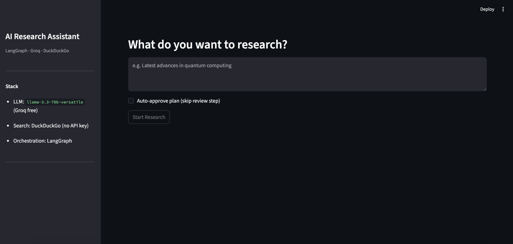
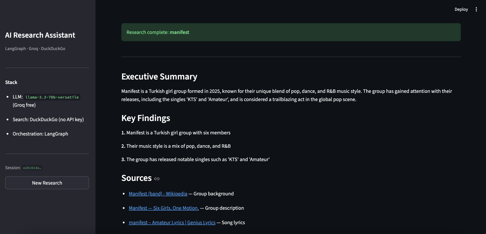

# Multi-Agent Research Workflow

AI research assistant built with **LangGraph** that autonomously searches the web, extracts and summarizes sources, and generates structured research reports — completely free to run.

## How It Works

```
Query
  │
  ▼
[planner]        Decomposes query into sub-tasks and search queries (LLM)
  │
  ▼
[human_review]   ── PAUSE ── you approve the plan or redirect with feedback (optional)
  │
  ▼
[searcher]       Searches DuckDuckGo for each query (sequential, with retry)
  │
  ▼
[extractor]      Scores and filters sources by relevance
  │
  ▼
[summarizer ×N]  Summarizes each source in parallel (LangGraph Send API)
  │
  ▼
[synthesizer]    Merges summaries → structured JSON report (LLM)
  │
  ▼
[storage_agent]  Persists session, sources, and costs to SQLite
  │
  ▼
Report
```

**Key features:**
- Human-in-the-loop review with redirect (re-plans based on your feedback)
- Parallel summarization via LangGraph's `Send` API fan-out
- Persistent state via `AsyncSqliteSaver` — sessions survive process restarts
- Per-node token tracking
- Async throughout — non-blocking web search and LLM calls
- Fully free stack — no paid APIs required

---

## Interface

The web interface (run with `streamlit run app.py`) lets you enter a query, review the AI-generated plan, and read the final report — all in the browser.

**Research query & plan review**



**Final report**



---

## Stack

| Layer | Tool |
|---|---|
| Orchestration | [LangGraph](https://github.com/langchain-ai/langgraph) (StateGraph + Send API) |
| LLM | [Groq](https://console.groq.com) — `llama-3.3-70b-versatile` (free tier) |
| Web Search | [ddgs](https://github.com/deedy5/ddgs) — DuckDuckGo (no API key) |
| Database | SQLite + SQLAlchemy async + aiosqlite |
| Checkpointing | LangGraph `AsyncSqliteSaver` |
| Config | pydantic-settings |
| CLI | Click + Rich |
| Web UI | Streamlit |

---

## Setup

### 1. Clone and install

```bash
git clone https://github.com/your-username/Multi-Agent-Workflow.git
cd Multi-Agent-Workflow
pip install -e ".[dev]"
```

### 2. Get a free Groq API key

Sign up at [console.groq.com](https://console.groq.com) 

### 3. Configure environment

```bash
cp .env.example .env
```

Edit `.env` and add your key:

```env
GROQ_API_KEY=gsk_...
```

That's the only required value. SQLite databases are created automatically.

---

## Usage

### Run a research query

```bash
python main.py research "Latest advances in quantum computing"
```

The pipeline pauses at human review and prompts you:

```
╭─ Human Review Required ───────────────────────╮
│ Plan:                                         │
│   • Understand quantum basics                 │
│   • Find recent breakthroughs                 │
│                                               │
│ Search queries:                               │
│   • quantum computing 2025 breakthroughs      │
│   • quantum error correction recent research  │
│   • quantum advantage applications            │
╰───────────────────────────────────────────────╯

Enter feedback or type 'approved' to continue [approved]:
```

- Type `approved` (or just press Enter) → continues
- Type anything else (e.g. `"focus on medical applications"`) → re-plans with your feedback

### Skip the review prompt

```bash
python main.py research "Your query" --auto-approve
```

### Save report to JSON

```bash
python main.py research "Your query" --auto-approve --output-json report.json
```

### Resume a paused session

```bash
# Sessions are saved by ID — you can resume from a new terminal
python main.py resume --session-id <uuid> --feedback "approved"
```

### View cost breakdown

```bash
python main.py cost-report --session-id <uuid>
```

### Run the web interface

```bash
streamlit run app.py
```

Opens at `http://localhost:8501` — enter a query, review the plan in the browser, and read the final report.

---

## Project Structure

```
Multi-Agent-Workflow/
├── main.py                      # CLI entry point
├── config/
│   └── settings.py              # pydantic-settings config
├── src/
│   ├── state.py                 # LangGraph TypedDict state schema
│   ├── graph.py                 # StateGraph builder
│   ├── memory.py                # AsyncSqliteSaver checkpointer
│   ├── cost_tracker.py          # Per-node token/cost tracking
│   ├── agents/
│   │   ├── planner.py           # Query → sub-tasks + search queries
│   │   ├── human_review.py      # HITL interrupt node
│   │   ├── searcher.py          # Executes DuckDuckGo searches
│   │   ├── extractor.py         # Scores and filters sources
│   │   ├── summarizer.py        # Summarizes one source (fan-out target)
│   │   ├── synthesizer.py       # Merges summaries → final report
│   │   └── storage_agent.py     # Persists results to SQLite
│   ├── tools/
│   │   ├── tavily_search.py     # DuckDuckGo search wrapper
│   │   ├── web_scraper.py       # httpx + BeautifulSoup fallback
│   │   └── db_writer.py         # SQLAlchemy upsert helper
│   └── database/
│       ├── models.py            # SQLAlchemy ORM models
│       ├── engine.py            # Async engine + init_db()
│       └── repository.py        # CRUD operations
└── tests/
    ├── conftest.py
    ├── test_planner.py
    ├── test_searcher.py
    ├── test_extractor.py
    ├── test_graph.py
    └── test_cost_tracker.py
```

---

## Running Tests

```bash
pytest tests/ -v
```

All tests mock LLM and search calls 

---

## Environment Variables

| Variable | Required | Default | Description |
|---|---|---|---|
| `GROQ_API_KEY` | **Yes** | — | Free Groq API key |
| `MODEL_NAME` | No | `llama-3.3-70b-versatile` | Groq model |
| `SQLITE_PATH` | No | `research.db` | SQLite file path |
| `MAX_SEARCH_RESULTS` | No | `8` | Results per search query |
| `MAX_SOURCES_TO_EXTRACT` | No | `5` | Sources to summarize |
| `MAX_RETRIES` | No | `3` | Retry limit for tool calls |
